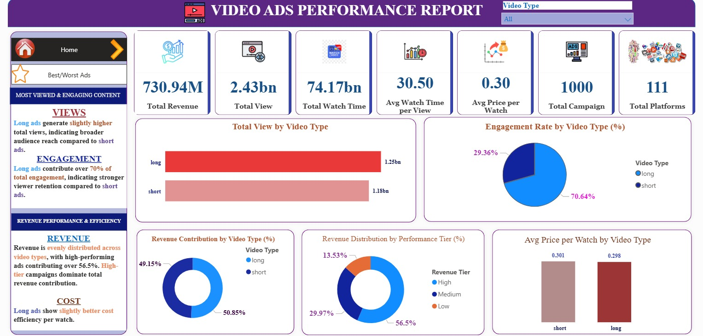
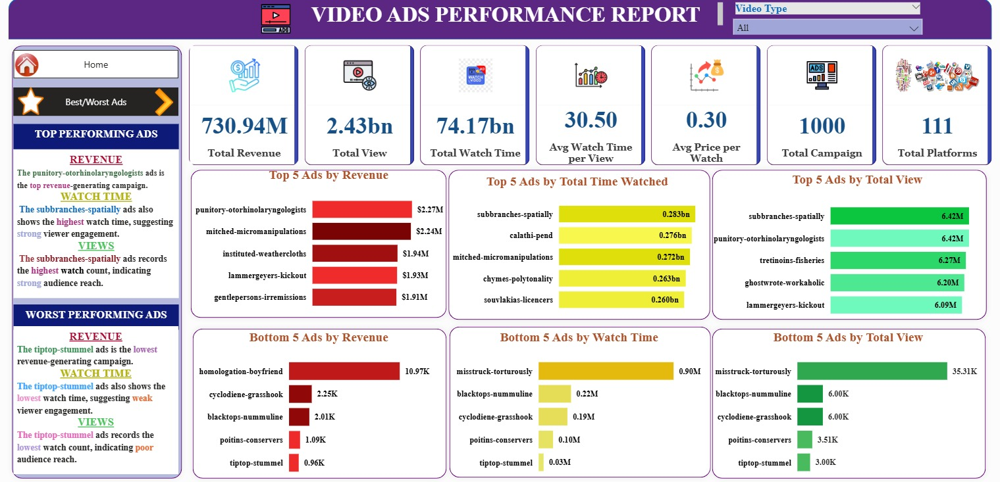

# 📊 Power BI Dashboard: Video Ad Performance Analysis

---

## 🧾 Overview

This project presents an **interactive Power BI dashboard** designed to analyze video advertisement performance. It delivers a clear, executive-level view of key business metrics, enabling stakeholders to evaluate campaign effectiveness, engagement, and cost efficiency.

---

## 🏠 Page 1: Home Dashboard

### Dashboard Preview

### Key Highlights
- Executive summary of revenue, views, watch time, and engagement
- Video type comparison
- Revenue contribution and performance tier distribution
- Cost efficiency insights

### Visuals Included
- KPI Cards
- Total Views by Video Type
- Engagement Contribution by Video Type
- Revenue Contribution by Video Type
- Revenue Distribution by Performance Tier
- Average Price per Watch by Video Type

---

## 📊 Page 2: Best & Worst Performing Ads

### Dashboard Preview

### Key Highlights
- Best-performing ads by revenue, views, and watch time
- Worst-performing ads by revenue, views, and watch time
- Quick identification of high-impact and underperforming campaigns

### Visuals Included
- Top 5 Ads by Revenue
- Top 5 Ads by Views
- Top 5 Ads by Watch Time
- Bottom 5 Ads by Revenue
- Bottom 5 Ads by Views
- Bottom 5 Ads by Watch Time

---

## 🎨 Dashboard Design

- Minimal and executive-friendly layout
- Clear separation between overview and detailed analysis
- Consistent color coding for video type and performance tiers
- Business-focused storytelling through visuals

---

## 🚀 Outcome

This dashboard helps stakeholders:
- Monitor overall ad performance
- Compare short vs long ad effectiveness
- Identify top and low-performing campaigns
- Support data-driven optimization decisions

---

## 💡 Portfolio Highlight

> Designed a two-page Power BI dashboard that transforms video advertising data into clear, actionable business insights through executive-level visual storytelling.
